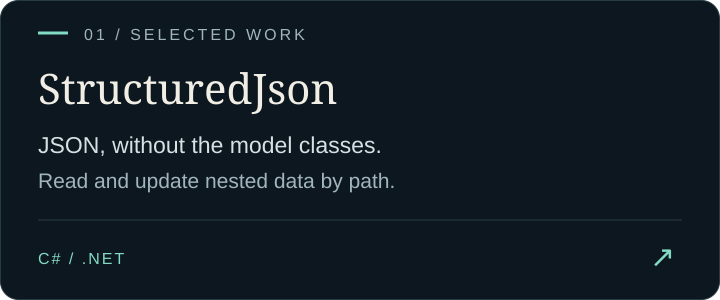
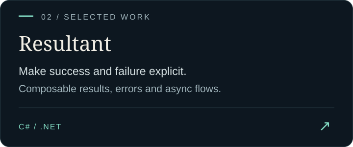
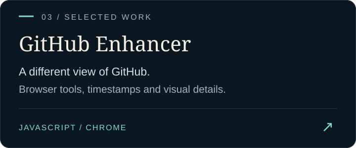
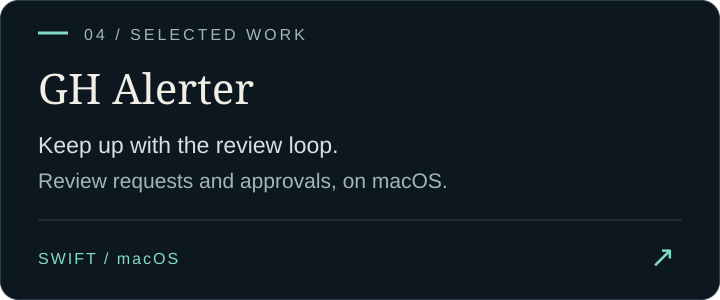

  

  <strong>Libraries with a purpose. Tools for the everyday.</strong> 
  C# / .NET, a little Swift, and a curiosity for making things work better.

  

  <a href="https://terekeci.dev/">Website</a> &nbsp; / &nbsp;
  <a href="https://www.linkedin.com/in/ardaterekeci/">LinkedIn</a> &nbsp; / &nbsp;
  <a href="https://github.com/search?q=author%3Aadomorn+is%3Apr+is%3Apublic&amp;type=pullrequests">Open-source activity</a>

 

### Selected work

  
  
  
  

Also built: **[DateTimeNow](https://github.com/adomorn/DateTimeNow)** — a Visual Studio extension for turning clock reads into fixed timestamp expressions.

 

### Beyond my own repos

Fixes and features I've implemented for issues in the .NET ecosystem and submitted upstream:

- **[ASP.NET Core · #46638](https://github.com/dotnet/aspnetcore/issues/46638)** — Fixed migrations endpoint exceptions caused by unsupported request methods and content types.
- **[AutoFixture · #987](https://github.com/AutoFixture/AutoFixture/issues/987)** — Fixed guard clause assertions for self-referencing generic interface constraints.
- **[Npgsql / EF Core · #3524](https://github.com/npgsql/efcore.pg/issues/3524)** — Added Daitch–Mokotoff fuzzy string matching support for PostgreSQL.

---

  Open to collaborating on <strong>.NET libraries, developer tools, and useful fixes.</strong> 
  Have a concrete idea? Start an issue in the relevant project or find me on <a href="https://www.linkedin.com/in/ardaterekeci/">LinkedIn</a>.

